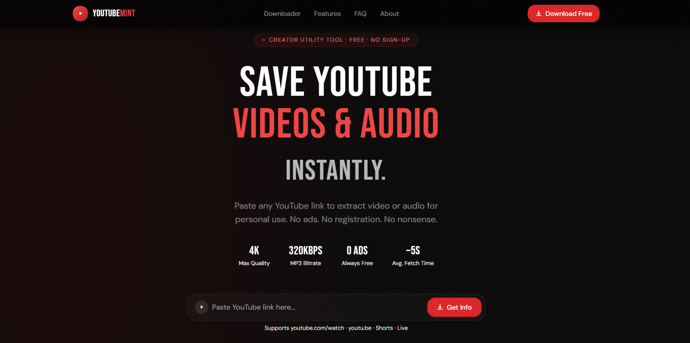

<div align="center">

# YouTubeMint

**A modern YouTube media utility — UI showcase & portfolio demo**


[Live Demo](https://youtubemint.vercel.app/)


</div>

---

## Overview

YouTubeMint is a full-stack YouTube media utility built to showcase modern frontend architecture, custom design system work, and clean API design. Paste any YouTube URL to see the complete UI flow in action — metadata preview, animated loading states, quality selection, and download interactions.

> **This is a public portfolio showcase.** The UI/UX, component architecture, TypeScript types, and API contract are all real and production-grade. The actual media processing logic (yt-dlp integration, FFmpeg conversion, rate limiting) lives in a private production repository and is replaced here with realistic mock responses.

---

## Tech Stack

| Layer | Technology | Purpose |
|---|---|---|
| Framework | Next.js 15 (App Router) | Full-stack React with API routes |
| Language | TypeScript 5.6 | End-to-end type safety |
| Styling | TailwindCSS 3 + custom CSS | Design system & animations |
| Notifications | Sonner | Toast notification system |
| Fonts | Bebas Neue + DM Sans | Display + body typography pair |
| Images | Next.js Image | Optimized thumbnail loading |
| Demo data | Static JSON | Mock metadata & simulated delays |

---

## Features

- **Smart URL validation** — accepts `youtube.com/watch`, `youtu.be`, `youtube.com/shorts`, `youtube.com/live`, and `music.youtube.com`
- **Metadata preview** — title, channel, view count, upload date, duration badge
- **Quality selector** — 360p / 480p / 720p / 1080p / Best, with per-format FPS info
- **MP3 extraction UI** — dedicated audio-focused download path (320 kbps in production)
- **Full loading flow** — skeleton loaders, animated progress indicators, disabled states
- **Error handling** — descriptive error states with retry UI
- **Responsive navbar** — animated hamburger menu on mobile
- **Accessible** — skip-to-content link, `aria-label`s, keyboard-navigable FAQ accordion
- **Legal pages** — Privacy Policy, Terms of Use, DMCA, Contact, About
- **Auto sitemap** — Next.js native `sitemap.ts`

---

## Design System

All visual design is custom — no UI library (no shadcn, no Radix, no MUI). Highlights:

- **Glassmorphism cards** with `backdrop-filter: blur` and layered border opacities
- **Gradient mesh background** using composited radial gradients
- **Noise texture overlay** for depth via SVG `feTurbulence`
- **CSS keyframe animations**: `slide-up`, `scale-in`, `fade-in`, `pulse-dot`, `shimmer-sweep`, `progress-bar`
- **Custom scrollbar** styling
- **Bebas Neue** display font for a YouTube-adjacent brand feel
- Red / black / white color palette with careful opacity layering

---

## Project Structure

```
src/
├── app/
│   ├── api/
│   │   ├── health/route.ts         ← Health check (returns demo status)
│   │   ├── info/route.ts           ← URL validation + mock metadata
│   │   └── download/
│   │       ├── mp3/route.ts        ← Simulated audio extraction
│   │       └── video/route.ts      ← Simulated video download
│   ├── about / contact / dmca / privacy / terms /
│   ├── sitemap.ts
│   ├── globals.css                 ← Full design token system
│   ├── layout.tsx                  ← Root layout + SEO metadata
│   └── page.tsx                    ← Homepage
├── components/
│   ├── layout/
│   │   ├── Navbar.tsx              ← Sticky navbar with mobile menu
│   │   └── Footer.tsx             ← Legal links + disclaimer
│   └── ui/
│       ├── Downloader.tsx          ← Core state machine (demo-aware)
│       ├── DemoBanner.tsx          ← ⚑ Demo mode indicator
│       ├── DownloadOptions.tsx     ← Quality picker + action buttons
│       ├── Hero.tsx
│       ├── VideoCard.tsx           ← Thumbnail preview card
│       ├── UrlInput.tsx            ← Validated URL input field
│       ├── SkeletonCard.tsx        ← Shimmer loading skeletons
│       ├── Features.tsx
│       ├── HowItWorks.tsx
│       ├── FAQ.tsx                 ← CSS-only accordion
│       └── LegalPage.tsx           ← Shared legal page layout
├── lib/
│   ├── demo-data.ts                ← ⚑ Static mock video metadata
│   ├── rate-limit.ts               ← Passthrough stub (production: per-IP limiting)
│   └── utils.ts                    ← cn() utility
├── services/
│   └── youtube.service.ts          ← ⚑ Typed stubs (production: yt-dlp calls)
├── utils/
│   ├── validators.ts               ← YouTube URL validation (real)
│   └── ffmpeg.ts                   ← ⚑ No-op stubs (production: FFmpeg wrapper)
└── types/index.ts                  ← Shared TypeScript interfaces
```

> Files marked ⚑ are intentionally mocked or stubbed for the public showcase. All other files are production-equivalent.

---

## What's Mocked vs Real

| File / Area | Status | Notes |
|---|---|---|
| YouTube URL validation | ✅ Real | Full regex validation, all URL formats |
| TypeScript types | ✅ Real | Identical to production types |
| UI components | ✅ Real | All animations, states, and interactions |
| Responsive layout | ✅ Real | Mobile menu, skeleton loaders, etc. |
| API route structure | ✅ Real | Same endpoints, same request/response shape |
| `youtube.service.ts` | 🔶 Stubbed | Typed function signatures, no implementation |
| `ffmpeg.ts` | 🔶 Stubbed | No-op functions, no filesystem access |
| `rate-limit.ts` | 🔶 Passthrough | Always returns `success: true` |
| `/api/info` | 🔶 Mocked | Returns static demo metadata after 1.8s delay |
| `/api/download/mp3` | 🔶 Mocked | Returns `{ demo: true, filename }` after delay |
| `/api/download/video` | 🔶 Mocked | Returns `{ demo: true, filename }` after delay |
| `/api/health` | 🔶 Mocked | Returns static `{ mode: "demo" }` |
| `lib/demo-data.ts` | 🟡 New | Static video metadata for showcase responses |
| `DemoBanner.tsx` | 🟡 New | Amber banner explaining demo mode |

---

## Getting Started

No system dependencies required — this is a pure Next.js app.

```bash
# 1. Clone
git clone https://github.com/yourname/youtubemint.git
cd youtubemint

# 2. Install
npm install

# 3. Run
npm run dev
# → http://localhost:3000
```

```bash
# Type check
npm run type-check

# Build for production (Vercel / Netlify)
npm run build && npm start
```

---

## Deploy

One-click deploy to Vercel — no environment variables needed for the demo build.

[](https://vercel.com/new/clone?repository-url=https://github.com/yourname/youtubemint)

---

## Production Architecture

The production version of this project adds:

- **yt-dlp** integration — spawned as a child process via `child_process.execFile` for metadata extraction and media download
- **FFmpeg** audio conversion — 320 kbps MP3 via `fluent-ffmpeg` with 44.1 kHz / stereo output
- **Temp file management** — UUID-namespaced files in a configurable temp directory, auto-deleted within 15 minutes
- **Per-IP rate limiting** — in-memory sliding-window limiter (20/min info, 5/min MP3, 3/min video)
- **Docker deployment** — multi-stage Alpine build with `standalone` Next.js output
- **Nginx reverse proxy** — with 360s timeout, buffer tuning, and HTTPS via Certbot
- **PM2 process manager** — cluster mode with log rotation and restart policies

---

## License

MIT — see [LICENSE](LICENSE) for details.

---

<div align="center">
  <sub>Built with Next.js 15 · TypeScript · TailwindCSS</sub>
</div>
